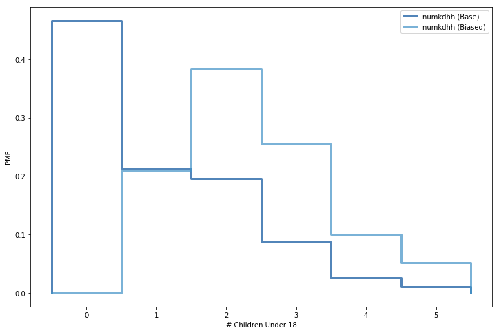

[Think Stats Chapter 3 Exercise 1](http://greenteapress.com/thinkstats2/html/thinkstats2004.html#toc31) (actual vs. biased)

### Code:

```python
import numpy as np
import matplotlib.pyplot as plt
%matplotlib inline
import nsfg
import first
import thinkstats2
import thinkplot

## Define Functions for Biased PMF
def BiasPmf(pmf, label):
    new_pmf = pmf.Copy(label=label)
    
    for x, p in pmf.Items():
        new_pmf.Mult(x, x)
        
    new_pmf.Normalize()
    return new_pmf
    
## Perform calculations
resp = nsfg.ReadFemResp()
base_pmf = thinkstats2.Pmf(resp.numkdhh, label='numkdhh (Base)')
biased_pmf = BiasPmf(base_pmf, label='numkdhh (Biased)')

## Plot results
thinkplot.PrePlot(2)
thinkplot.Pmfs([base_pmf, biased_pmf])
thinkplot.Show(xlabel='# Children Under 18', ylabel='PMF')

## Print results
print("Means:")
print("------")
print("Base Data: \t%0.4f" % base_pmf.Mean())
print("Biased Data: \t%0.4f" % biased_pmf.Mean())
```

### Output:

> Means:
> 
> -
> 
> Base Data: 	1.0242
> 
> Biased Data: 	2.4037

