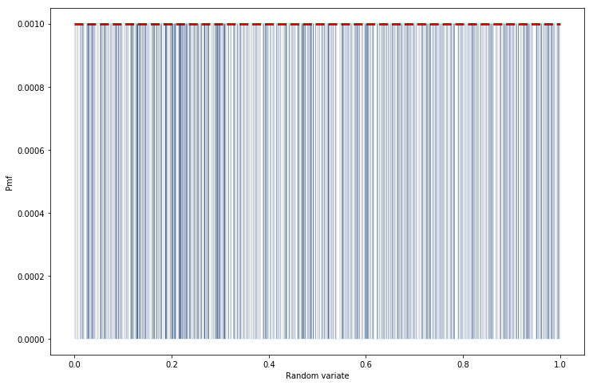

[Think Stats Chapter 4 Exercise 2](http://greenteapress.com/thinkstats2/html/thinkstats2005.html#toc41) (a random distribution)

### Code:

```python
import numpy as np
import matplotlib.pyplot as plt
%matplotlib inline
import nsfg
import first
import thinkstats2
import thinkplot

## Generate 1000 random numbers
size = 1000
rn = np.random.random(size=size)

## Compute PMF of random number array
pmf = thinkstats2.Pmf(rn)
print("Expect Uniform Distribution w/ PMF = %0.4f" % (1./size))

## Plot PMF
plt.figure(figsize=(12,8))
plt.plot([0,1], [1./size, 1./size], 'r--', linewidth=3, )
thinkplot.Pmf(pmf, linewidth=0.1)
thinkplot.Show(xlabel='Random variate', ylabel='Pmf')
```

### Output:

We expect a uniform distribution with PMF value equalling 0.01:

